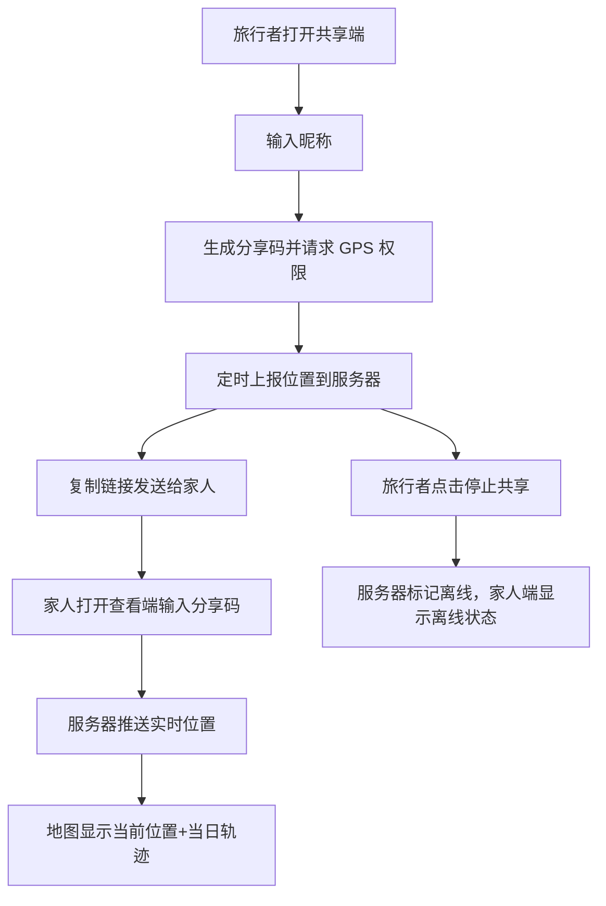

# 旅行安全定位追踪 — 产品需求文档 (PRD)

## 1. 产品概述

为出境旅行者（如泰国旅行）提供一款实时定位与行动轨迹追踪应用，让家人能在任意设备上实时查看旅行者的当前位置和当日行动轨迹，缓解家人对出行安全的担忧。

- 核心价值：低门槛、即开即用的位置共享，无需安装原生 App，通过浏览器即可完成位置上报与查看
- 目标用户：出境旅行者（共享端） + 其家人（查看端）

## 2. 核心功能

### 2.1 用户角色

| 角色 | 使用方式 | 核心权限 |
|------|----------|----------|
| 旅行者（共享端） | 浏览器打开，输入昵称生成分享码 | 持续上报 GPS 位置、查看自己当日轨迹、一键停止共享 |
| 家人（查看端） | 浏览器打开，输入分享码 | 实时查看旅行者当前位置 + 当日全部轨迹点、查看状态（在线/离线） |

### 2.2 功能模块

1. **共享端页面**：昵称输入、开始共享按钮、实时位置状态、当日轨迹、电量/信号提示
2. **查看端页面**：输入分享码、实时地图定位、当日轨迹折线、状态指示、时间轴
3. **分享码生成与校验**：生成 6 位字母数字码，链接可一键复制

### 2.3 页面详情

| 页面名称 | 模块名称 | 功能描述 |
|----------|----------|----------|
| 共享端 `/share` | 输入区 | 输入昵称，生成唯一分享码 |
| 共享端 `/share` | 状态面板 | 显示当前经纬度、更新时间、在线状态、已上报次数 |
| 共享端 `/share` | 地图区 | 显示自身当前位置 + 当日轨迹折线 |
| 共享端 `/share` | 控制区 | 开始/停止共享按钮、复制分享链接按钮 |
| 查看端 `/watch` | 输入区 | 输入 6 位分享码，校验后进入查看 |
| 查看端 `/watch` | 地图区 | 实时显示旅行者位置标记 + 当日轨迹折线 |
| 查看端 `/watch` | 信息面板 | 旅行者昵称、最后更新时间、在线状态 |
| 查看端 `/watch` | 时间轴 | 当日轨迹点列表，点击可定位到该点 |

## 3. 核心流程

旅行者打开共享端 → 输入昵称 → 生成分享码并开始上报 GPS → 将链接/分享码发给家人 → 家人打开查看端输入分享码 → 实时看到位置与轨迹

## 4. 用户界面设计

### 4.1 设计风格

- 主色调：深海蓝 `#0A1628`（信任、安全） + 青绿 `#00E5A0`（活力、在线指示）
- 辅助色：暖橙 `#FF8A3D`（警告/轨迹高亮）、灰白 `#E8EEF7`
- 按钮：圆角 12px，主按钮青绿渐变，次按钮描边透明
- 字体：标题 `Space Grotesk`，正文 `Inter`
- 布局：移动端优先，地图全屏铺满，底部浮动信息卡片
- 图标：Lucide 线性图标，状态点带呼吸动画

### 4.2 页面设计概览

| 页面名称 | 模块名称 | UI 元素 |
|----------|----------|----------|
| 共享端 | 输入区 | 大圆角输入框、青绿渐变按钮、柔和阴影 |
| 共享端 | 状态面板 | 半透明毛玻璃卡片、在线呼吸点、数值大字 |
| 共享端 | 地图区 | 全屏 Leaflet 地图、自定义脉冲定位标记 |
| 查看端 | 地图区 | 全屏地图、暖橙色轨迹折线、定位标记 |
| 查看端 | 信息面板 | 底部浮层卡片、昵称+时间+状态、时间轴滚动列表 |

### 4.3 响应式

- 移动端优先（手机浏览器是主要使用场景）
- 地图占满视口，信息卡片可收起
- 桌面端：地图 + 侧边信息栏双栏布局
