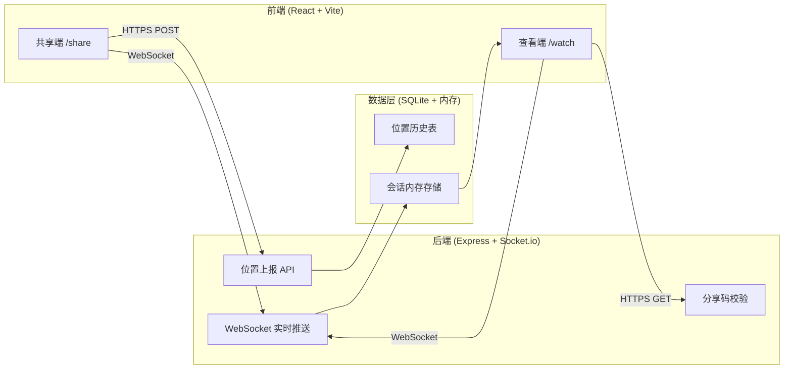
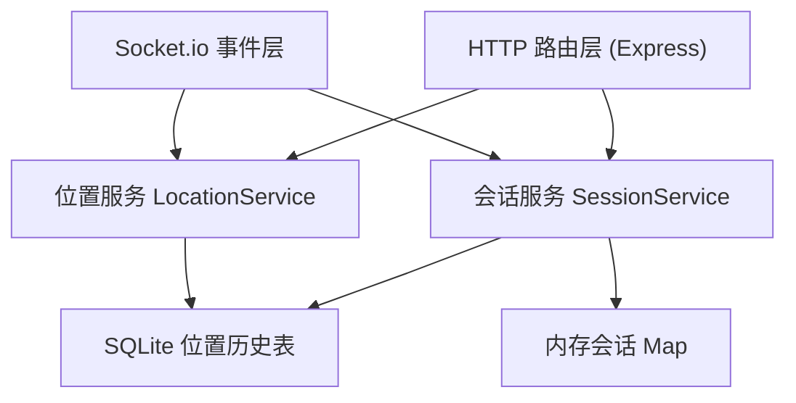
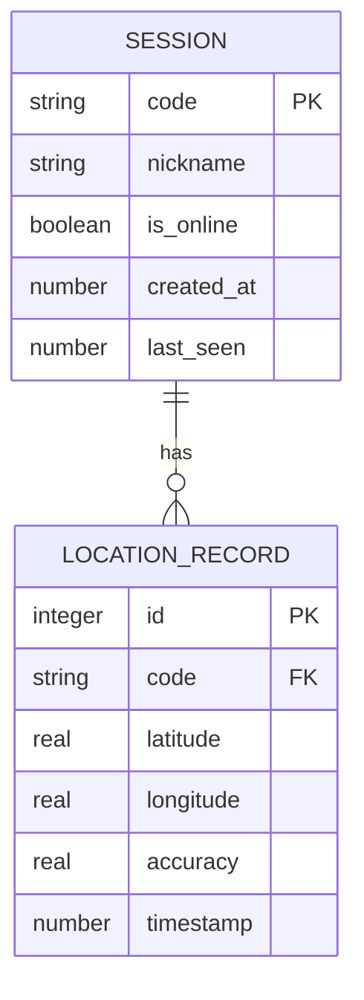

# 旅行安全定位追踪 — 技术架构文档

## 1. 架构设计



## 2. 技术说明

- 前端：React@18 + React Router + TailwindCSS@3 + Vite
- 地图：Leaflet@1.9 + react-leaflet@4（OpenStreetMap 瓦片，免费免密钥）
- 后端：Node.js + Express@4 + Socket.io@4
- 数据库：better-sqlite3（轻量本地存储当日轨迹）
- 实时通信：WebSocket（Socket.io）实现位置秒级推送
- 定位：浏览器 Geolocation API（HTTPS 下可用）

## 3. 路由定义

| 路由 | 用途 |
|------|------|
| `/` | 首页：选择共享或查看 |
| `/share` | 共享端：上报位置 |
| `/watch` | 查看端：输入分享码查看 |
| `/watch/:code` | 查看端：直接通过分享码链接查看 |

后端 API：

| 方法 | 路径 | 用途 |
|------|------|------|
| POST | `/api/sessions` | 创建会话，返回分享码 |
| POST | `/api/locations` | 上报位置 |
| GET | `/api/sessions/:code` | 校验分享码并获取会话信息 |
| GET | `/api/sessions/:code/track` | 获取当日轨迹点 |

## 4. API 定义

```typescript
// 创建会话请求
interface CreateSessionRequest {
  nickname: string;
}

// 创建会话响应
interface CreateSessionResponse {
  code: string;        // 6位分享码
  shareUrl: string;    // 完整查看链接
}

// 位置上报请求
interface LocationReport {
  code: string;
  latitude: number;
  longitude: number;
  accuracy: number;    // 精度(米)
  timestamp: number;
}

// 轨迹点
interface TrackPoint {
  latitude: number;
  longitude: number;
  accuracy: number;
  timestamp: number;
}

// WebSocket 事件
// 旅行者端 emit: 'location:update' (LocationReport)
// 家人端 emit: 'watch:join' ({ code })
// 服务器 broadcast to watchers: 'location:update' (LocationReport)
// 服务器 broadcast: 'session:offline' ({ code })
```

## 5. 服务端架构图



## 6. 数据模型

### 6.1 数据模型定义



### 6.2 数据定义语言

```sql
CREATE TABLE IF NOT EXISTS session (
  code TEXT PRIMARY KEY,
  nickname TEXT NOT NULL,
  is_online INTEGER NOT NULL DEFAULT 1,
  created_at INTEGER NOT NULL,
  last_seen INTEGER NOT NULL
);

CREATE TABLE IF NOT EXISTS location_record (
  id INTEGER PRIMARY KEY AUTOINCREMENT,
  code TEXT NOT NULL,
  latitude REAL NOT NULL,
  longitude REAL NOT NULL,
  accuracy REAL,
  timestamp INTEGER NOT NULL,
  FOREIGN KEY (code) REFERENCES session(code)
);

CREATE INDEX IF NOT EXISTS idx_location_code_time 
  ON location_record(code, timestamp);
```
